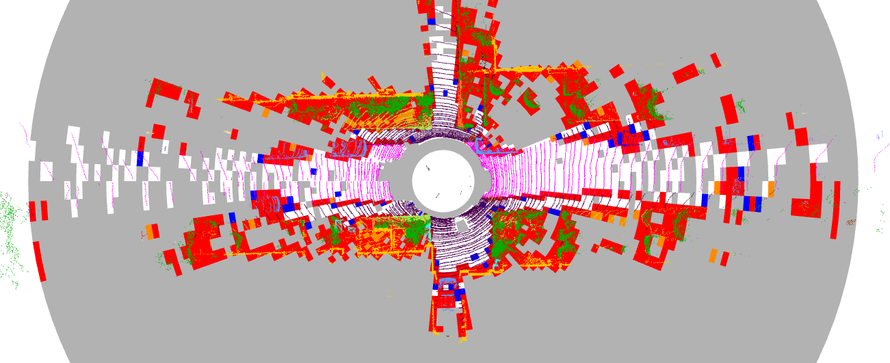
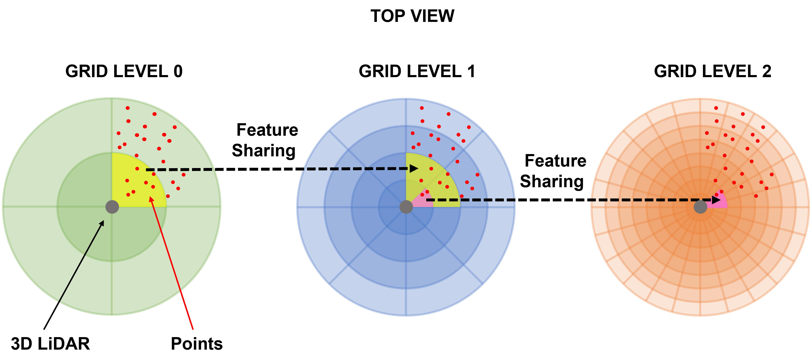

# Pyramidal 3D Feature Fusion on Polar-Grids for Fast and Robust Traversability Analysis on CPU

## Requirements

 - yaml-cpp

    > refer to https://github.com/jbeder/yaml-cpp

 - Open3D
    
    > refer to https://github.com/isl-org/Open3D, BUT
    
    > follow these guidelines https://github.com/isl-org/Open3D/issues/2286#issuecomment-765353244

 - OpenCV >= 4.2 

## Build & Run

 - Fill config.yaml, in particular the paths to the dataset (and output path)  
 > mkdir -p build & cd build  
 > cmake ..  
 > make

 - in folder "models" we put some sample models (used in the paper)
      - they can be used to have an immediate feedback of how the system works

 > ./test

 ## Train models

 - First of all we need data, in particular features belonging to cells, to train our models
 - The following will produce the data (in multi-threading setting to speed up the process if frames are numerous)
 > ./produce_data

 - then, we can train our models 

 > ./train

